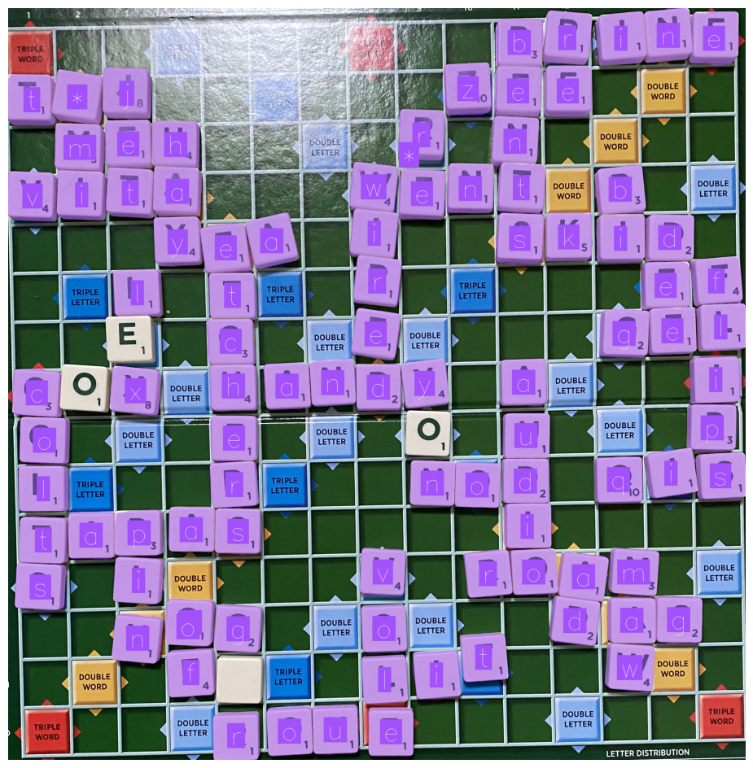

# scrabble-reading

This project is an exploration of digitising Scrabble boards with [SAM 3](https://github.com/facebookresearch/sam3) and [Perception Encoder](https://github.com/facebookresearch/perception_models).

The code is not complete, but is a starting point for thinking about how to use zero-shot models for columnar/row-wise OCR.

Here is an example showing an input image with the SAM 3 segmentation masks and Perception Encoder masks laid on top:



The notebook processes the detections to return a text version of the game board:

```
BOARD:

- - - - - - - - - - b r i n e
t * j - - - - - - z e e - - -
- m e h - - - - r - n - - - -
v i t a - - - w e n t - b - -
- - - y e a - i - - s k i d -
- - l - t - - r - - - - - e f
- - - - c - - e - - - - g e l
c - x - h a n d y - a - - - i
o - - - e - - - - - u - - - p
l - - - r - - - n o d - q i s
t a p a s - - - - - i - - - -
s - i - - - - v - r o a m - -
- - n o g - - o - t - d a g -
- - - f - - - l i - - - w - -
- - - - r o u e - - - - - - -

STATS:

# of unique words: 37
len() of longest words: 7
longest word(s): etchers

len() of shortest words: 2
shortest word(s): li, ef, of, rt, bi, re, ad
```

### How it Works

This project:

1. Uses SAM 3 to find the Scrabble game board in an image.
2. Crops the game board.
3. Uses SAM 3 to find all Scabble letters.
4. Crops all letters.
5. Uses Perception Encoder to classify each letter.
6. Maps each letter classification to its corresponding segmentation mask.
7. Uses the bounding boxes corresponding to each segmentation mask to create a 15x15 grid.

### Limitations

This project does not employ perspective correction. Instead, my notebook tries to manually calculate how many rows there are and divide the board up into rows. This leads to several potential errors in an image whose perspective is not straight. I may experiment with perspective correction in the future, but I was certainly curious about how far I could get just by assuming that tiles are all the same height in a birds-eye image.

This project was designed to process birds-eye views of Scrabble boards. Angled images or images with missing rows or columns will not work.

I think SAM 3 can only return 100 detections at one time. This means that if there are more than 100 tiles on a board, some tiles will be missed.

## API key

This project needs a [Roboflow API key to work](https://docs.roboflow.com/developer/authentication/find-your-roboflow-api-key).

## License

This repository is licensed under an MIT license. See the [SAM 3 repository](https://github.com/facebookresearch/sam3/blob/main/LICENSE) and [Perception Encoder repository](https://github.com/facebookresearch/perception_models) for their respective licenses.
